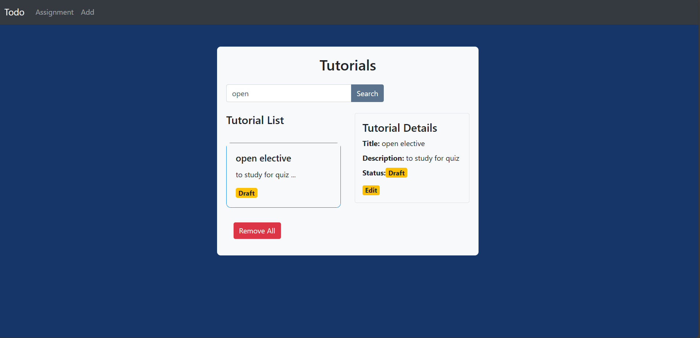

# Crudify: A Crud Application

## 📌 About the Project
The CRUDIFY application is a full-stack CRUD (Create, Retrieve, Update, Delete) system designed to manage tutorials. Its robust architecture combines a backend and front end, providing a seamless experience for handling tutorial-related data.

## 🎥 Demo
🔗 [Watch the Demo Video](https://www.youtube.com/watch?v=7udHirYCIqM)

## 🚀 Features
- The CRUDIFY application is a full-stack CRUD (Create, Retrieve, Update, Delete) system designed to manage tutorials
- demonstrates the effectiveness of integrating modern web technologies to develop a full-stack application 
- One of the key features of CRUDIFY is its search functionality, which allows users to locate specific tutorials by their title, enhancing usability for larger datasets

## 🛠️ Tech Stack
- **Frontend:** HTML, CSS, JAVASCRIPT, REACT
- **Backend:** SPRINGBOOT 
- **Database:** MySQL 
